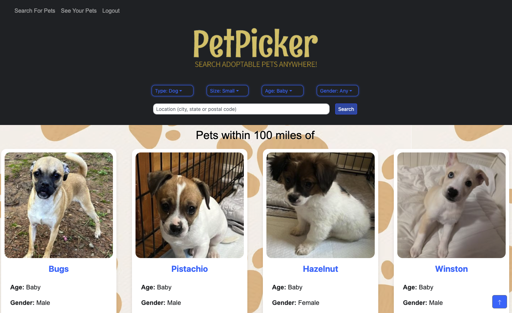

# Pet Picker

An innovative platform designed to enhance your pet adoption experience by leveraging the latest web technologies. Dive into a user-friendly interface where the wonders of the animal kingdom are just a click away. Built on the MERN stack with GraphQL, our application promises a seamless and dynamic user interaction.

## Table of Contents
1. [Project Description](#project-description)
2. [Technology Stack](#technology-stack)
3. [Installation Instructions](#installation-instructions)
4. [Usage](#usage)
5. [Features](#features)
6. [How to Contribute](#how-to-contribute)
7. [License](#license)
8. [Contact Us](#contact-us)

## Project Description
Pet Picker revolutionizes the pet adoption process through a modern web application. By converting a RESTful API to GraphQL, it ensure efficient and precise data handling. Authenticated users can easily search, view, and save their favorite pets to revisit at any time. Deployed on Heroku and powered by MongoDB Atlas, our application ensures accessibility and reliability.

## Technology Stack
- **Frontend**: React.js
- **Backend**: Node.js, Express.js, GraphQL, Apollo Server
- **Database**: MongoDB with Mongoose ODM
- **Authentication**: JWT for secure access and bcrypt for password hashing
- **Deployment**: Heroku with MongoDB Atlas

## Installation Instructions
Accessing Pet Picker requires no installation. Simply navigate to our [deployed site](https://pet-picker-mern.herokuapp.com/) to start your pet adoption journey.

## Usage
To explore Pet Picker:
1. Visit our [Deployed Site](https://pet-picker-mern.herokuapp.com/).
2. Sign up or log in to access personalized features.
3. Browse or search for pets by category.
4. Save your favorite pets for future reference.

## Features
- **User Authentication**: Secure sign-up and login processes with JWT and bcrypt for password hashing, ensuring the safety and privacy of your information.
- **Advanced Search Functionality**: Filter pets by category, age, size, and more to find your perfect match.
- **Favorite Pets Management**: Save and manage your favorite pets with ease, allowing for a personalized adoption experience.
- **Intuitive, Responsive Design**: Enjoy a seamless experience across various devices, thanks to our user-friendly and responsive interface.
- **Secure User Experience**: With the implementation of bcrypt for password security, it ensures that your account information is safely encrypted and stored.

## How to Contribute
Interested in contributing? I'd love your help improving Pet Picker! Please reach out to me on GitHub for more information on how to get involved.

## Contact Us
For any questions or contributions, please reach out to me via GitHub.

Thank you for exploring Pet Picker, where your next pet adventure begins!
